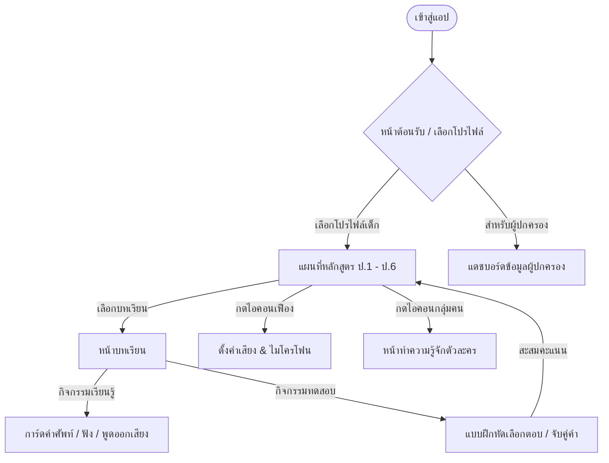

# 🎨 ข้อเสนอแนะและแผนงานพัฒนา UX/UI สำหรับเด็กและผู้ปกครอง (UX/UI Analysis & Implementation Proposal)

เอกสารฉบับนี้จัดทำขึ้นเป็น **คู่มือและแผนปฏิบัติงานทางเทคนิค (Technical Spec & Guide)** เพื่อส่งต่อให้ **Claude** อ่าน วิเคราะห์ และนำไปเขียนโค้ด/ปรับปรุงสไตล์ CSS, HTML และ JavaScript ของโปรเจกต์ **Fun English Journey** ให้มีหน้าตาสวยหรู น่ารัก น่าเล่น และใช้งานง่ายสำหรับเด็กเล็ก พร้อมทั้งให้ความโปร่งใสและสร้างความไว้วางใจให้แก่ผู้ปกครอง

---

## 👥 1. การวิเคราะห์กลุ่มผู้ใช้งานเป้าหมาย (Target Audience Analysis)

การออกแบบแอปพลิเคชันเพื่อการศึกษาต้องการความสมดุลระหว่างสองขั้วผู้ใช้งาน:

### 👧👦 ก. กลุ่มเด็กเล็ก (นักเรียน ป.1 - ป.6) — "เน้นความน่ารัก น่าเล่น และปฏิกิริยาโต้ตอบ"
* **การรับรู้ทางสายตา (Visual Perception)**: เด็กเล็กชอบรูปทรงโค้งมน (Rounded Shapes) ไร้ขอบคม, สีสันพาสเทลที่สว่างสดใสแต่ไม่ฉูดฉาดจนปวดตา (Soothing Pastels), และตัวละครนำเรื่อง (Ducky & Friends) ที่มีชีวิตชีวา
* **การโต้ตอบ (Micro-interactions)**: การกดปุ่มต้องมีความรู้สึกของการตอบสนองทางกายภาพ (เช่น ปุ่มยุบตัวได้แบบ 3D หรือ Claymorphism), มีเสียงเอฟเฟกต์ (SFX) ประกอบ, และภาพเคลื่อนไหวฉลองความสำเร็จ (Bounce/Stars/Sparkles) เมื่อตอบถูก
* **การลดภาระการรับรู้ (Cognitive Load Reduction)**: หลีกเลี่ยงการให้พิมพ์ข้อความยาว ๆ ให้ใช้ปุ่มตัวเลือกขนาดใหญ่ (Large Tap Targets) และการ์ดไอคอนสื่อความหมายแทน

### 👩‍💻👨‍💻 ข. กลุ่มผู้ปกครอง (Parents) — "เน้นความสวยหรู ความโปร่งใส และการดูความก้าวหน้า"
* **การรับรู้ทางสายตา (Visual Perception)**: ต้องการอินเตอร์เฟสที่ดูสะอาดตา สวยหรู จัดเรียงเนื้อหาเป็นสัดส่วน (Clean Dashboard Layout) เพื่อความน่าเชื่อถือทางวิชาการ
* **การควบคุมและตั้งค่า (Control & Monitoring)**: ปรับแต่งระบบเสียงและความไวไมโครโฟนได้ง่าย (เนื่องจากระดับเสียงพูดของเด็กมีความดังเบาแตกต่างกัน), มีรายงานสรุปความก้าวหน้าการเรียนรู้ IndexedDB (ประวัติการเก็บดาวและคะแนน XP ในแต่ละระดับชั้น) เพื่อให้ชื่นชมความพยายามของลูกได้ตรงจุด

---

## 📐 2. แผนผังโครงสร้างการไหลของระบบ (UX Navigation Flow)



---

## 🎨 3. ข้อเสนอแนะการปรับปรุงสไตล์และสถาปัตยกรรม (UI Enhancement Plan)

> [!IMPORTANT]
> **สำหรับ Claude:** รบกวนดำเนินการนำ CSS Class และ HTML Structure ด้านล่างนี้ไปแปลงลงไฟล์ [style.css](file:///Volumes/Work/work01/English_fun/fun-english-journey/css/style.css) และ [index.html](file:///Volumes/Work/work01/English_fun/fun-english-journey/index.html) เพื่อให้ได้ UI แนว **Premium Claymorphism**

### ก. การยกระดับความน่าเล่น (Playful Claymorphism Buttons & Cards)
ปุ่มเดิมในระบบเป็นแบบเรียบแบนธรรมดา เราจะปรับให้เป็นปุ่ม 3D นุ่มนิ่มน่ากดเหมือนดินน้ำมัน โดยใช้คุณสมบัติ CSS เงาซ้อนหลายชั้น (Multi-layered Shadows) และการยุบตัวทางฟิสิกส์เมื่อมีอีเวนต์ `:active`:

```css
/* ปรับปรุงปุ่มให้น่ากดแบบ 3D Claymorphism */
.btn {
  font-family: inherit;
  font-size: 1.15rem;
  font-weight: 800;
  border: none;
  border-radius: 24px;
  padding: 16px 26px;
  cursor: pointer;
  color: var(--white);
  background: var(--blue);
  /* ใช้เงาสองชั้น: ชั้นนอกเป็นมิติปุ่ม ชั้นในเป็นไฮไลท์สีขาวด้านบน */
  box-shadow: 
    0 8px 0 #1B75D0, 
    inset 0 4px 0 rgba(255,255,255,0.4),
    0 12px 20px rgba(29,53,87,0.15);
  transition: all 0.1s ease-out;
  transform: translateY(0);
}

.btn:hover {
  transform: translateY(-2px);
  box-shadow: 
    0 10px 0 #1B75D0, 
    inset 0 4px 0 rgba(255,255,255,0.4),
    0 15px 25px rgba(29,53,87,0.2);
}

.btn:active {
  transform: translateY(6px);
  box-shadow: 
    0 2px 0 #1B75D0, 
    inset 0 1px 0 rgba(255,255,255,0.2),
    0 4px 8px rgba(29,53,87,0.15);
}

/* ปุ่มสีเหลือง Ducky */
.btn.yellow {
  background: var(--duck);
  color: var(--ink);
  box-shadow: 
    0 8px 0 #D49D0E, 
    inset 0 4px 0 rgba(255,255,255,0.5),
    0 12px 20px rgba(29,53,87,0.15);
}
.btn.yellow:hover {
  box-shadow: 
    0 10px 0 #D49D0E, 
    inset 0 4px 0 rgba(255,255,255,0.5),
    0 15px 25px rgba(29,53,87,0.2);
}
.btn.yellow:active {
  box-shadow: 
    0 2px 0 #D49D0E, 
    inset 0 1px 0 rgba(255,255,255,0.3),
    0 4px 8px rgba(29,53,87,0.15);
}
```

### ข. การปรับปรุงหน้าต้อนรับ (Premium Welcome Screen Interface)
ปรับแต่ง `#scr-welcome` ให้มีลักษณะเป็นโรงเรียน Ducky's Pond School ที่น่าดึงดูดใจ และจัดวางการ์ดเลือกโปรไฟล์ให้มีความสวยหรูด้วย Glassmorphism (พื้นหลังเบลอผสมความโปร่งแสง):

```css
/* การ์ดต้อนรับแนว Glassmorphism */
.card-welcome {
  background: rgba(255, 255, 255, 0.85);
  backdrop-filter: blur(12px);
  -webkit-backdrop-filter: blur(12px);
  border: 2px solid rgba(255, 255, 255, 0.4);
  border-radius: 32px;
  padding: 24px;
  box-shadow: 0 16px 32px rgba(29, 53, 87, 0.08);
}
```

### ค. หน้าแดชบอร์ดผู้ปกครองโฉมใหม่ (Beautiful Parents Dashboard in `parents.html`)
ปรับหน้า [parents.html](file:///Volumes/Work/work01/English_fun/fun-english-journey/parents.html) ที่เดิมเป็นเพียงรายการตัวหนังสือธรรมดา ให้เป็น **Dashboard การ์ดสองคอลัมน์สีสันอบอุ่นน่าเชื่อถือ** มีเมนูที่ชัดเจน และสามารถต่อยอดดึงความก้าวหน้าของเด็กมาพล็อตเป็นกราฟหรือเกจพลังได้:

```html
<!-- แนะนำโครงสร้างใหม่ของ parents.html เพื่อให้ Claude นำไปเปลี่ยนรูปโฉม -->
<div class="parents-grid">
  <div class="card card-parent-metric">
    <div class="header">
      <span class="icon">📈</span>
      <h3>ความก้าวหน้าของหนู</h3>
    </div>
    <div class="progress-summary">
      <p>เลือกรวมดาวสะสมและเวลาเรียนของหนูบนเครื่องนี้</p>
      <div class="metric-row">
        <div class="metric-item">
          <span class="val" id="parent-total-stars">⭐ 0</span>
          <span class="lbl">ดาวทั้งหมด</span>
        </div>
        <div class="metric-item">
          <span class="val" id="parent-total-xp">💎 0</span>
          <span class="lbl">XP สะสม</span>
        </div>
      </div>
    </div>
  </div>

  <div class="card card-tips">
    <div class="header">
      <span class="icon">💡</span>
      <h3>เคล็ดลับสำหรับคุณพ่อคุณแม่</h3>
    </div>
    <ul class="parent-tips-list">
      <li><b>ให้ลองทำเองก่อน:</b> ปล่อยให้เด็กฟังและตอบด้วยตัวเอง หากมีข้อผิดพลาดระบบจะมีสัญญาณสอนเบาๆ ไม่ควรตอบแทนในทันที</li>
      <li><b>คำชมคือพลังบวก:</b> เน้นชื่นชมความพยายามและการกล้าพูดออกเสียง มากกว่าการกดดันให้ได้ 3 ดาวในทุกๆ ครั้ง</li>
    </ul>
  </div>
</div>
```

---

## 🛠️ 4. คำแนะนำการรันสคริปต์ JavaScript ในการซิงค์ข้อมูลผู้ปกครอง (IndexedDB Integration)

เพื่อให้ข้อมูลความก้าวหน้าในหน้าผู้ปกครองอัปเดตตรงตามไฟล์ฐานข้อมูล IndexedDB ที่เด็กเก็บสะสมคะแนนจริง ให้ Claude เขียนโค้ดเชื่อมโยง IndexedDB ในไฟล์ `js/engine.js` หรือเขียนฟังก์ชันเรียกโหลดข้อมูลลงใน `parents.html` ดังนี้:

```javascript
// ฟังก์ชันเรียกดูสถิติรวมผู้เล่นในหน้าแดชบอร์ดผู้ปกครอง
async function loadParentsDashboardData() {
  try {
    const db = new FEJDatabase();
    await db.init();
    const profiles = await db.getAllProfiles();
    
    if (profiles && profiles.length > 0) {
      let totalStars = 0;
      let totalXP = 0;
      
      profiles.forEach(p => {
        totalXP += (p.xp || 0);
        // วนลูปนับดาวจากวิชาเรียนที่บันทึก
        if (p.progress) {
          Object.values(p.progress).forEach(starsCount => {
            totalStars += starsCount;
          });
        }
      });
      
      // นำข้อมูลไปอัปเดตลง Element ในหน้า parents.html
      const starEl = document.getElementById('parent-total-stars');
      const xpEl = document.getElementById('parent-total-xp');
      if (starEl) starEl.textContent = `⭐ ${totalStars}`;
      if (xpEl) xpEl.textContent = `💎 ${totalXP} XP`;
    }
  } catch (err) {
    console.error("Failed to load metrics for parents: ", err);
  }
}
```

---

## 🚀 5. สรุปเช็คลิสต์ขั้นตอนถัดไปสำหรับ Claude (Action Items)

1. **[x] อัปเดตไฟล์สไตล์ [style.css](file:///Volumes/Work/work01/English_fun/fun-english-journey/css/style.css)**: เติมสไตล์ปุ่มแบบ 3D Claymorphism, เพิ่มเอฟเฟกต์ Transition เมื่อกดปุ่มตัวเลือก, และจัด CSS Class สำหรับหน้า Glassmorphism ต้อนรับ
2. **[x] ปรับโฉมหน้าผู้ปกครอง [parents.html](file:///Volumes/Work/work01/English_fun/fun-english-journey/parents.html)**: จัดหน้าการอ่านใหม่จากตารางข้อความเดิมให้เป็น Card Grid ที่ดูสวยงามหรูหรา และเรียกสถิติรวมของเด็กจาก IndexedDB มาสรุปให้ผู้ปกครองชื่นชมผลงานของลูกได้ตรงเป๊ะ
3. **[x] Polish Micro-animations**: ใส่การหน่วงหน้าน้อย ๆ (Ease-in-out) และเพิ่มขอบโค้งมนให้กับการ์ดรูปภาพบทเรียนเพื่อให้ดูเป็นสื่อสำหรับเด็กเล็กมากขึ้น

---

## ✅ Implementation Note (ดำเนินการแล้ว 12 ก.ค. 2026)

ดำเนินการตามข้อเสนอแล้ว โดยปรับรายละเอียดทางเทคนิคให้ตรงกับระบบจริงดังนี้:

- ฐานข้อมูลใช้ `indexedDB.open("FunEnglishJourneyDB", 1)` และ object store `profiles`
- ข้อมูลดาวอ่านจาก `profile.stars` ไม่ใช่ `profile.progress`
- สถิติที่แสดงประกอบด้วย XP, ดาว, จำนวนบทที่มีดาว และรายการแยกตามโปรไฟล์
- ชื่อผู้เล่นและข้อมูลโปรไฟล์สร้างด้วย DOM API และ `textContent` ไม่แทรกผ่าน `innerHTML`
- แยกโค้ดหน้าแดชบอร์ดไว้ที่ `fun-english-journey/js/parents-dashboard.js` เพื่อไม่เพิ่มภาระให้ lesson engine
- รักษาระบบ Audio Manager, Settings และ Microphone Test ที่มีอยู่เดิม
- เพิ่ม responsive breakpoints สำหรับมือถือ แท็บเล็ต และจอใหญ่
- เพิ่ม `prefers-reduced-motion` และคง focus indicator สำหรับ keyboard accessibility
- hover effect ทำงานเฉพาะอุปกรณ์ที่รองรับ hover เพื่อไม่รบกวนหน้าจอสัมผัส

### ไฟล์ที่แก้หรือเพิ่ม

- `fun-english-journey/index.html`
- `fun-english-journey/css/style.css`
- `fun-english-journey/css/information.css`
- `fun-english-journey/parents.html`
- `fun-english-journey/js/parents-dashboard.js`

### การตรวจสอบที่ผ่าน

- JavaScript syntax check
- HTML duplicate ID check
- CSS brace balance
- Git whitespace/error check
- ตรวจ schema IndexedDB และ property ของดาวให้ตรง engine ปัจจุบัน

### การทดสอบที่ยังควรทำบนอุปกรณ์จริง

- iPad Safari แนวตั้งและแนวนอน
- iPhone/Android ขนาดจอเล็ก
- Desktop Safari/Chrome ที่รองรับ hover
- หน้า Dashboard เมื่อไม่มีโปรไฟล์ มีหนึ่งโปรไฟล์ และมีหลายโปรไฟล์
- การซูมข้อความ 200% และ Reduce Motion
