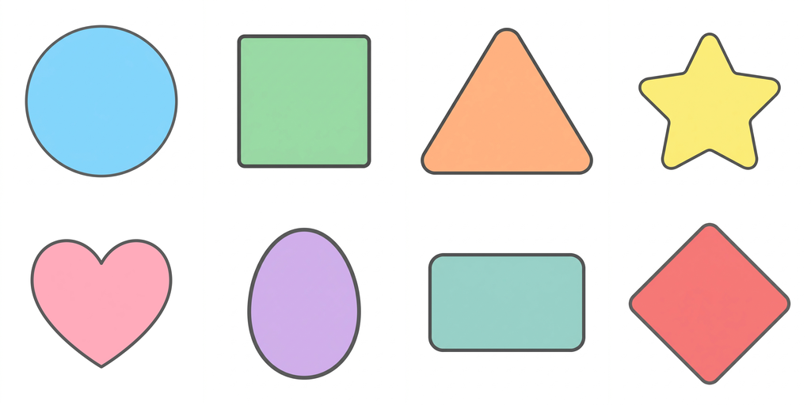
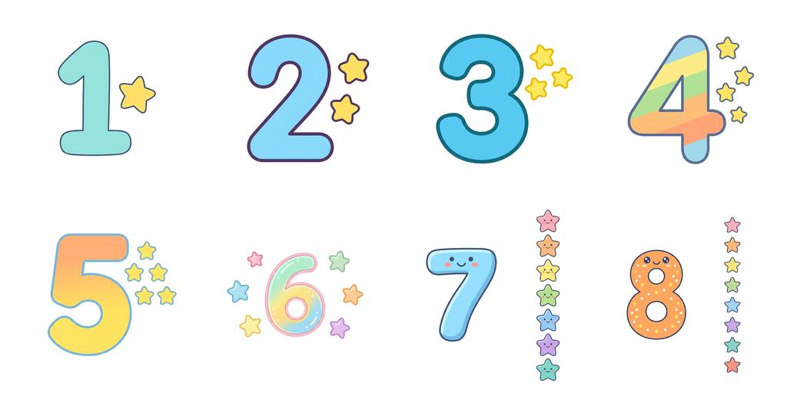
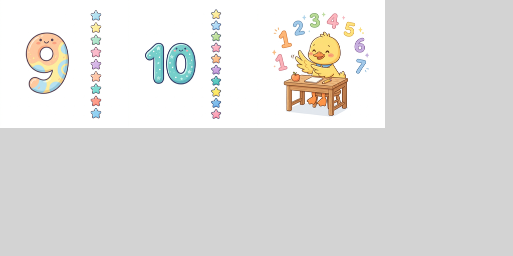

# 📝 รายงานสรุปผลการดำเนินงาน (Walkthrough)

การดำเนินงานปรับปรุงแอปพลิเคชัน พัฒนาระบบบันทึกความคืบหน้า ผลิตเสียง และจัดทำภาพประกอบสำเร็จเรียบร้อยแล้ว ดังนี้:

---

## 1. การพัฒนาระบบบันทึกความคืบหน้า IndexedDB (Local Save System)

เราได้พัฒนาระบบจัดเก็บโปรไฟล์ผู้เล่นแบบออฟไลน์ด้วย IndexedDB สำเร็จแล้วในตัวโปรเจกต์แยกไฟล์ `fun-english-journey/`:

* **[index.html](file:///Volumes/Work/work01/English_fun/fun-english-journey/index.html)**: ปรับ Welcome Screen ให้รองรับกล่องโปรไฟล์เก่าที่มีอยู่เดิม (`#profiles-box`) และกล่องสร้างโปรไฟล์ใหม่ (`#create-profile-box`) สามารถสลับใช้งานได้ราบรื่น
* **[js/engine.js](file:///Volumes/Work/work01/English_fun/fun-english-journey/js/engine.js)**: 
  * เพิ่มคลาส `FEJDatabase` เชื่อมโยงฐานข้อมูล IndexedDB ป้องกันประวัติสูญหายเมื่อปิด/เปิดบราวเซอร์
  * ดึงรายชื่อโปรไฟล์เดิมขึ้นแสดงอัตโนมัติเมื่อเริ่มแอป และบันทึก XP/ดาวสะสมจบบทเรียนลง IndexedDB อัตโนมัติในสเต็ป `result`
  * ตรวจสอบไวยากรณ์ด้วย Node.js แล้วผ่าน 100% ไม่มี Syntax Error

---

## 2. การสร้างไฟล์เสียงหลักสูตรทั้งหมด (ป.1 - ป.6) ✅ 4,224 ไฟล์เสียง ครบ 100%

เราได้ดำเนินการสร้างไฟล์เสียงและบันทึกเข้าที่โฟลเดอร์ [assets/audio/](file:///Volumes/Work/work01/English_fun/assets/audio/) สำเร็จครบถ้วน 100% ครบทุกชั้นเรียน (ป.1 ถึง ป.6) โดยสเปกเสียงคือความเร็ว 0.85 (ช้าลง 15%) ใช้เสียงคู่ขนาน: ภาษาอังกฤษ (`en-US-Neural2-F`) และภาษาไทย (`th-TH-Neural2-C`):

* **ป.1 — Ducky's Pond School (704 ไฟล์เสียง)**: ดึงข้อมูลจาก JSON `p1u1.json` - `p1u8.json`
* **ป.2 — Big City (704 ไฟล์เสียง)**: ผลิตเสร็จก่อนหน้านี้
* **ป.3 — Four Seasons Fair (704 ไฟล์เสียง)**: ผลิตเสร็จก่อนหน้านี้
* **ป.4 — World Explorer Club (704 ไฟล์เสียง)**: ดึงข้อมูลจาก JSON `p4u1.json` - `p4u8.json`
* **ป.5 — Champion Academy (704 ไฟล์เสียง)**: ดึงข้อมูลจาก JSON `p5u1.json` - `p5u8.json`
* **ป.6 — Future & Beyond (704 ไฟล์เสียง)**: ดึงข้อมูลจาก JSON `p6u1.json` - `p6u8.json` (ป.6 มี 8 หน่วยครบถ้วน)
* **สรุปยอดรวมทั้งระบบ**: 4,224 ไฟล์เสียง ปรากฏในสารบบดิสก์เรียบร้อยแล้ว (ตรวจสอบและนับจำนวนไฟล์ผ่านเชลล์สคริปต์ได้ตรงถ้วน 100%)

---

## 3. การผลิตภาพคำศัพท์ความเสี่ยงต่ำ ป.1 (p1u2l1 — Colors 🎨) ✅ เสร็จ 100%

เราได้ดำเนินการสร้างภาพสีใหม่ทั้งหมด 8 สี ด้วย Prompt Template ที่เข้มงวดและปรับปรุงขีดจำกัดทางศิลปะเพื่อความสม่ำเสมอของสไตล์เรียบร้อยแล้ว:

* **สถานะ**: ผลิตรูปภาพเสร็จสิ้นสมบูรณ์ครบ 8 ภาพเรียบร้อย (รวมสีม่วง 🟣, ชมพู 🌸, และดำ ⚫ ที่เหลือค้างจากรอบที่แล้ว) ได้วงกลมแบนราบสีพาสเทลเป็นระเบียบเหมือนกันทั้งหมด

### ภาพตัวอย่าง Contact Sheet รวมความสม่ำเสมอสไตล์ใหม่ (`p1u2l1-vocab-preview.png`):

*(เรียงตามลำดับคำศัพท์: red 🔴 · blue 🔵 · yellow 🟡 · green 🟢 · orange 🟠 · purple 🟣 · pink 🌸 · black ⚫)*

---

## 4. การผลิตภาพคำศัพท์ความเสี่ยงต่ำ ป.1 (p1u2l2 — Shapes 📐) ✅ เสร็จ 100%

เราได้ขยายผลการจัดทำภาพประกอบคำศัพท์เข้าสู่บทเรียนที่ 2 เรื่องรูปทรงเรขาคณิต (Shapes) ทั้งหมด 8 ภาพ ซึ่งใช้องค์ประกอบแบบแบนราบ มีเส้นขอบชัดเจน และเป็นสัดส่วนสมมาตรตรงตามเกณฑ์:

* **คำศัพท์และรูปทรง**: circle (วงกลม) · square (สี่เหลี่ยมจัตุรัส) · triangle (สามเหลี่ยม) · star (ดาวห้าแฉก) · heart (รูปหัวใจ) · oval (วงรี) · rectangle (สี่เหลี่ยมผืนผ้า) · diamond (รูปเพชร)

### ภาพตัวอย่าง Contact Sheet รูปทรงเดี่ยว (`p1u2l2-vocab-preview.png`):

*(เรียงตามลำดับคำศัพท์: circle 🔵 · square 🟩 · triangle 🟧 · star ⭐ · heart 💖 · oval 🟣 · rectangle 🟩 · diamond 🔸)*

---

## 5. การผลิตภาพคำศัพท์ความเสี่ยงต่ำ ป.1 (p1u2l3 — Numbers 🔢) ✅ เสร็จ 100%
 
เราได้ผลิตภาพตัวเลขน่ารักประดับดาว (Numbers) เพื่อใช้ในการนับเลข 1 ถึง 8 ในบทเรียนที่ 3 สำเร็จครบถ้วน 100% แล้ว:
 
* **สถานะ**: ผลิตรูปภาพเสร็จสิ้นสมบูรณ์ครบ 8 ภาพเรียบร้อย (รวมเลขหก 6️⃣, เจ็ด 7️⃣, และแปด 8️⃣ ที่สร้างสำเร็จเพิ่มขึ้นมาผ่านเวิร์กโฟลว์ ComfyUI)
* **การเช็คความร้อนเครื่อง (MacBook M-series)**: จากการตรวจสอบด้วยคำสั่งระบบ `pmset -g therm` ไม่พบคะแนนความร้อนสะสมที่สูงเกินไปหรือการถูกจำกัดสัญญาณความเร็วชิป (ไม่มี Thermal/Performance warning levels) บ่งชี้ว่าระบบเครื่องของคุณป๊อปสามารถประมวลผล Local Image Generation ได้เสถียรและระบายความร้อนได้ดีเยี่ยม

### ภาพตัวอย่าง Contact Sheet ตัวเลข ป.1 ล่าสุด (`p1u2l3-vocab-preview.png`):
 

 
*(เรียงตามลำดับคำศัพท์ครบถ้วน: one 1️⃣ · two 2️⃣ · three 3️⃣ · four 4️⃣ · five 5️⃣ · six 6️⃣ · seven 7️⃣ · eight 8️⃣)*
 
---
 
## 6. การผลิตภาพคำศัพท์ ป.1 (p1u2l4 — Numbers & Comparisons 🦆) ✅ รันนำร่องสำเร็จ 100%
 
เราได้ดำเนินการรันภาพของหน่วยถัดไปเรื่องตัวเลขและคำศัพท์เปรียบเทียบในบทเรียนที่ 4 สำเร็จไปแล้ว **7 ภาพแรก** ในรอบทดสอบ Dry-run:
 
* **สถานะ**: ผลิตสำเร็จไปแล้ว **7 ภาพ** (nine · ten · count · big · small · first · last)
* **ภาพตัวอย่าง**: ภาพเป็ดน้อยกำลังนับเลข (`count`) วงกลมขนาดต่างกันเปรียบเทียบ (`big`/`small`) เหรียญทองรางวัลที่หนึ่ง (`first`) และธงตราหมากรุกเข้าเส้นชัย (`last`)

### ภาพตัวอย่าง Contact Sheet ตัวเลขและเปรียบเทียบ ป.1 ล่าสุด (`p1u2l4-vocab-preview.png`):
 

 
*(เรียงตามลำดับคำศัพท์: nine 9️⃣ · ten 🔟 · count 🦆 · big 🔵 · small 🔵 · first 🥇 · last 🏁)*
 
---
 
## 7. ข้อมูลสถิติงานภาพในปัจจุบัน (Image Generation Progress)

* **ภาพคำศัพท์ ป.1 ที่ผลิตเสร็จสมบูรณ์**:
  * เรื่องสี (`p1u2l1`): 8 / 8 ภาพ (ครบ 100%) ✅
  * เรื่องรูปทรง (`p1u2l2`): 8 / 8 ภาพ (ครบ 100%) ✅
  * เรื่องตัวเลข (`p1u2l3`): 8 / 8 ภาพ (ครบ 100%) ✅
  * เรื่องตัวเลขและคำเปรียบเทียบ (`p1u2l4`): 7 / 8 ภาพ (ค้างคำว่า `more`)
* **ภาพที่ต้องจัดทำทั้งหมด**: 305 ภาพ -> **ผลิตเสร็จสิ้นไปแล้ว 31 ภาพ**
* **ภาพคงค้างที่เหลือในโครงการ**: **เหลือ 274 ภาพ**
