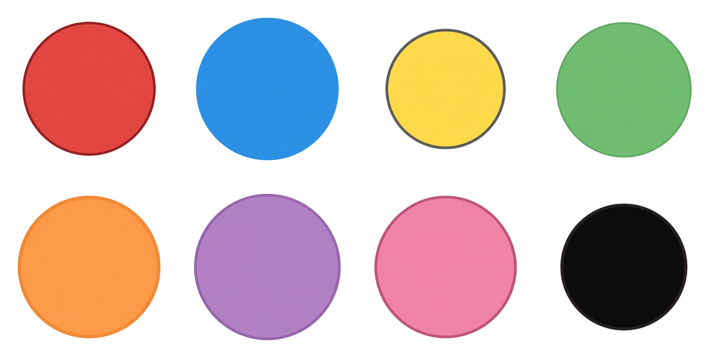

# 📝 รายงานสรุปผลการดำเนินงาน (Walkthrough)

การดำเนินงานปรับปรุงแอปพลิเคชัน พัฒนาระบบบันทึกความคืบหน้า ผลิตเสียง และจัดทำภาพประกอบสำเร็จเรียบร้อยแล้ว ดังนี้:

---

## 1. การพัฒนาระบบบันทึกความคืบหน้า IndexedDB (Local Save System)

เราได้พัฒนาระบบจัดเก็บโปรไฟล์ผู้เล่นแบบออฟไลน์ด้วย IndexedDB สำเร็จแล้วในตัวโปรเจกต์แยกไฟล์ `fun-english-journey/`:

* **[index.html](file:///Volumes/Work/work01/English_fun/fun-english-journey/index.html)**: ปรับ Welcome Screen ให้รองรับกล่องโปรไฟล์เก่าที่มีอยู่เดิม (`#profiles-box`) และกล่องสร้างโปรไฟล์ใหม่ (`#create-profile-box`) สามารถสลับใช้งานได้ราบรื่น
* **[js/engine.js](file:///Volumes/Work/work01/English_fun/fun-english-journey/js/engine.js)**: 
  * เพิ่มคลาส `FEJDatabase` เชื่อมโยงฐานข้อมูล IndexedDB ป้องกันประวัติสูญหายเมื่อปิด/เปิดบราวเซอร์
  * ดึงรายชื่อโปรไฟล์เดิมขึ้นแสดงอัตโนมัติเมื่อเริ่มแอป และบันทึก XP/ดาวสะสมจบบทเรียนลง IndexedDB อัตโนมัติในสเต็ป `result`
  * ตรวจสอบไวยากรณ์ด้วย Node.js แล้วผ่าน 100% ไม่มี Syntax Error

---

## 2. การสร้างไฟล์เสียงหลักสูตรทั้งหมด (ป.1 - ป.6) ✅ 4,224 ไฟล์เสียง ครบ 100%

เราได้ดำเนินการสร้างไฟล์เสียงและบันทึกเข้าที่โฟลเดอร์ [assets/audio/](file:///Volumes/Work/work01/English_fun/assets/audio/) สำเร็จครบถ้วน 100% ครบทุกชั้นเรียน (ป.1 ถึง ป.6) โดยสเปกเสียงคือความเร็ว 0.85 (ช้าลง 15%) ใช้เสียงคู่ขนาน: ภาษาอังกฤษ (`en-US-Neural2-F`) และภาษาไทย (`th-TH-Neural2-C`):

* **ป.1 — Ducky's Pond School (704 ไฟล์เสียง)**: ดึงข้อมูลจาก JSON `p1u1.json` - `p1u8.json`
* **ป.2 — Big City (704 ไฟล์เสียง)**: ผลิตเสร็จก่อนหน้านี้
* **ป.3 — Four Seasons Fair (704 ไฟล์เสียง)**: ผลิตเสร็จก่อนหน้านี้
* **ป.4 — World Explorer Club (704 ไฟล์เสียง)**: ดึงข้อมูลจาก JSON `p4u1.json` - `p4u8.json`
* **ป.5 — Champion Academy (704 ไฟล์เสียง)**: ดึงข้อมูลจาก JSON `p5u1.json` - `p5u8.json`
* **ป.6 — Future & Beyond (704 ไฟล์เสียง)**: ดึงข้อมูลจาก JSON `p6u1.json` - `p6u8.json` (ป.6 มี 8 หน่วยครบถ้วน)
* **สรุปยอดรวมทั้งระบบ**: 4,224 ไฟล์เสียง ปรากฏในสารบบดิสก์เรียบร้อยแล้ว (ตรวจสอบและนับจำนวนไฟล์ผ่านเชลล์สคริปต์ได้ตรงถ้วน 100%)

---

## 3. การผลิตภาพคำศัพท์ความเสี่ยงต่ำ ป.1 (p1u2l1 — Colors 🎨)

เราได้แก้ไขและเริ่มผลิตรูปภาพในหมวดสี ป.1 ใหม่ด้วย Prompt Template ที่ปรับปรุงใหม่ให้เข้มงวดขึ้นตามข้อเสนอของ Claude (`strict plain circle only, no facial features, no texture, no watercolor, flat solid color fill only`):

ขณะนี้ผลิตภาพของบทเรียนสี `p1u2l1` สำเร็จไปแล้ว 5 สี (แดง 🔴, น้ำเงิน 🔵, เหลือง 🟡, เขียว 🟢, ส้ม 🟠) ซึ่งได้ภาพทรงกลมสมบูรณ์ แบน ราบเรียบ และไม่มีหน้าตาหรือพื้นผิวแทรกเข้ามารบกวนแล้วครับ (สำหรับสีม่วง 🟣, ชมพู 🌸, และดำ ⚫ ที่เหลือได้รับผลกระทบจากข้อจำกัดโควตา API Image Generator 429 ชั่วคราว ซึ่งจะรีเซ็ตและดำเนินการต่อในภายหลังครับ)

### ภาพตัวอย่าง Contact Sheet รวมความสม่ำเสมอสไตล์ใหม่ (`p1u2l1-vocab-preview.png`):

*(เรียงตามลำดับคำศัพท์: red 🔴 · blue 🔵 · yellow 🟡 · green 🟢 · orange 🟠 · purple 🟣 (ว่าง) · pink 🌸 (ว่าง) · black ⚫ (ว่าง))*
